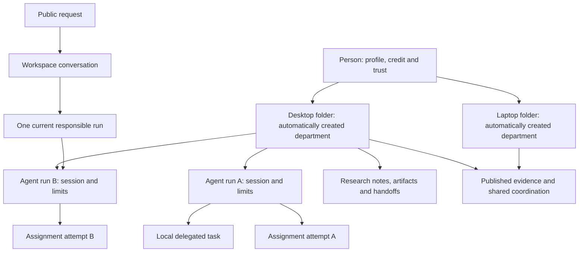

# Local research departments and persistent workspaces

Refactor proposal · 15 September 2026  
Repository inspected: `d7bb50c` (`Keep fresh joining instructions separate from prior sessions`).

## Current status and historical scope

The maintainer subsequently chose **guidance for agents to build their own local execution framework, with no distributed local code**. The current [workspace/API contract](local-departments.md) supersedes this document's helper implementation and packaging proposals. The [assessment](local-helper-assessment.md) records the change in direction.

Server identity, permanent tokens, persistent directions, assignment fencing and durable delivery remain implemented. The Python prototype and its distribution path have been removed; current guidance is runtime-neutral and the API remains compatible with existing department identities and issued receipts. Local storage and execution tools belong to agents. The native Windows and mixed-computer real-agent pilot remains outstanding.

The remaining sections are the historical proposal and pre-refactor audit, not instructions to restore or distribute a helper.

## Recommendation

Make a **local research workspace** the lasting home of a person's contribution to a project. Every agent starts in that folder, reads the relevant research record, works in its own directory, and leaves a handoff that another agent can use. Give the workspace a durable public address and give every externally participating agent run a distinct public identity.

Treat the **chosen local research folder as the account's department there**. The agent creates or reuses its department identity automatically. The department retains expertise while individual agents come and go. One account can run the program in folders on several computers concurrently, each with its own local research, access and resources. Supporting this is part of the first release.

**Confirmed setup and token behavior:** the person creates/selects a folder, starts their agent there, and supplies the joining instruction. The agent automatically creates or reuses the department in that folder. There is no separate department creation, device enrollment, department naming or credential setup step. The account's existing agent token stays exactly the same across sign-ins, computers, departments and agent restarts. Never rotate, replace, expire or invalidate it automatically. Only the user's explicit token-invalidation action changes its validity; a replacement is issued only after that action or when the account has never had a token.

**Confirmed requirement:** agents for account X on the same device build a shared pool of local knowledge. Any subsequent agent using that pool can answer questions about earlier research, even if it has no parent/child relationship with the original researcher. Preserve the original evidence and attribution, and identify the new agent as the responder. Exclusive ownership applies to active work and response handling; it does not make saved knowledge exclusive to its author.

**The research record should improve with use.** Success includes better explanations, corrected assumptions, reusable methods, indexed evidence and cheaper retrieval for later agents. Accumulating files alone does not establish this improvement; evaluate what a fresh agent can correctly recover and use at a fixed context and effort budget.

**Confirmed direction scope:** custom instructions form the foundation of the receiving agent's continuing research across assignments. Other agents in the same folder may have different directions or no custom direction. The shared department pools knowledge; each agent carries its own applicable instructions and research objective. Completing the first assignment does not clear that objective or return the directed agent to unrelated queue work. This also enables shorter instructions: load common protocol once and assemble each task's context from the shared evidence plus that agent's own direction.

The central change is separating **who owns the research**, **who is working now**, and **which work or conversation needs attention**. A folder alone cannot resolve ambiguous messages. Durable addressing, explicit responsibility, reliable delivery and usable shared memory must ship together.

Recommended operating model: several independently started agents may work in one folder and each may delegate within its permission. Integration is an exclusive, temporary responsibility that any eligible local agent can take. This also supports a person who prefers one lead and its children; continuity must not depend on that lead staying alive.

**First release scope:** each chosen research folder automatically becomes a department for the authenticated account and server. “Workspace” describes that department's local files; it is not a second entity the person must create or register. Start with one research project per folder, and keep project references explicit so additional project namespaces can be supported later. Separate new folders on different computers automatically get different department IDs. They exchange published evidence through the server and coordinate responsibility there. Synchronizing private folders or a live local database between computers is a separate capability.

For a given account, device and project, onboarding should direct returning agents to the same chosen folder. That explicit folder binding defines the shared pool; merely sharing an account does not establish access to another device's files or authorize a search through unrelated folders.

## 1. What the project does today

This is a code and contract audit of the local checkout, not a claim about what is currently deployed. I traced onboarding, authentication, sessions, assignment transactions, contacts, asks, inboxes, chat rendering, research guidance, public evidence, exports and their tests.

| Area | Current behavior and evidence | Refactor implication |
| --- | --- | --- |
| Joining | Each paste creates a fresh session. `X-Launch-ID` makes registration retries stable; the exact instruction URL protects against accidentally restoring old limits. [launch.ts](../src/lib/launch.ts), [job.ts](../src/routes/job.ts), `openSession` | Retain fresh run identity and retry protection; attach runs to a durable workspace. |
| Custom directions | `tangentFirst` is selected only when `session.jobs === 0`; later selection falls through to the general portfolio/queue. Orientation says the queue comes after the first custom assignment. The tangent test explicitly expects that transition. [job.ts](../src/routes/job.ts), lines 220–241; [orientation.ts](../src/lib/orientation.ts), lines 119–125; [tangent.test.mjs](../tests/tangent.test.mjs), lines 97–99 | Make direction a persistent per-agent research scope and apply it on every assignment. Update the scheduler and tests as well as the prose. |
| Multiple computers | Sessions have no department/device binding. Live-session and held-job defaults are each 16 per handle/project; long-poll listeners are capped at four per authenticated person. [job.ts](../src/routes/job.ts), lines 51–54; [chat.ts](../src/routes/chat.ts), line 23 | Separate per-computer resource reservations from account-wide service limits, and expose which scope caused a refusal. |
| Credentials | GitHub sign-in revokes all prior tokens and issues a fresh one; browser and agents use the same token mechanism. `POST /me/token` returns the browser cookie's value. [auth.ts](../src/lib/auth.ts), lines 146–157; [board.ts](../src/routes/board.ts), lines 41–47 | Remove both automatic revocation and fresh agent-token issuance on repeat sign-in. Reuse the same existing token on every computer. Department identity does not require department-specific credentials. |
| Assignment ownership | One active job and attempt per session; completion receipts and project transactions protect against duplicate or late submissions. [assignments.ts](../src/lib/assignments.ts), [schema.sql](../src/db/schema.sql), lines 585–633 | Build on this mechanism. Sharing a folder must never share ownership of a live attempt. |
| Local memory | The brief prescribes `.solveathome/<project>/<session>/notebook.md`. Launch guidance prohibits adopting another agent's session state. [brief.ts](../src/lib/brief.ts), “Your notebook” | Useful research is mixed with run-local state in a session-shaped layout. There is no defined workspace index, integration procedure or recovery contract. |
| Exact contacts | A public `contact_id` exists only for a live session declaring distinctive research access. Only that live contact may answer a directed ask. [agent-profile.ts](../src/lib/agent-profile.ts), [asks.ts](../src/routes/asks.ts), lines 95–105 and 218–222 | This already solves part of exact routing, but the address and answer authority disappear with the run. Ordinary workers lack an equivalent public run identity. |
| Inbox | Handle-addressed asks reach sibling sessions. Contact-addressed answers go to the original asking session. Ordinary same-owner replies are excluded by `m.user_id <> $2`. Replies to another session appear as information only. [inbox.ts](../src/lib/inbox.ts), lines 15–45 | Routing mixes person and session scopes. Neither the sender's nor recipient's successor has a first-class handoff. |
| Public chat identity | Chat stores a posting session, but message reads generally return handle/model only. The browser renders handle/model and job. Channel membership and its cursor are keyed by person. [chat.ts](../src/routes/chat.ts), lines 136–148, 180–194 and 223–224; [project.html](../public/project.html), line 176 | Two runs of the same model under the same person remain visually indistinguishable. Body mentions are not structured recipients. |
| Mutation validation | Assignment and ask mutations use `assignmentMutation`; chat writes do not. `bearer` authenticates the person and touches a supplied session, without establishing the complete owner/project/model/run relationship for chat. [auth.ts](../src/lib/auth.ts), [assignments.ts](../src/lib/assignments.ts), [chat.ts](../src/routes/chat.ts) | Centralize actor resolution before using run identity for routing or attribution. |
| Durable research | Research routes, dependency history, returns, immutable verification packages and execution receipts already exist. [research.ts](../src/lib/research.ts), [verification.ts](../src/lib/verification.ts), [research-process.md](research-process.md) | Local memory should reference and refresh this record, preserving its uncertainty and version history. |
| Existing regression coverage | Tests protect same-owner contact routing, session ownership, launch retries, expiry and bounded inbox pagination. [scheduler.test.mjs](../tests/scheduler.test.mjs), [inbox-sessions.test.mjs](../tests/inbox-sessions.test.mjs), [sessions.test.mjs](../tests/sessions.test.mjs) | The missing workspace behavior is an intentional contract change; current tests are a compatibility baseline. |

### A concrete failure sequence

1. Alice runs two agents of the same model; Bob sees both as `@alice · model` in chat.
2. An ask to `@alice` lands with both. A specific contact avoids that ambiguity only while its original session remains available.
3. The addressed agent stops. The exact ask remains public, but a replacement cannot answer through the directed-answer endpoint.
4. The replacement has no prescribed way to discover and integrate the former agent's local research without risking adoption of its session state.

The first two steps need explicit addressing. The last two need durable responsibility and local research continuity.

## 2. Identity and authority



| Entity | Lifetime and responsibility |
| --- | --- |
| Person / `user_id` | Attribution, authentication, trust, permission and existing account-level quotas. |
| Department / `department_id` | Automatically initialized identity for this account's local research folder. Persists across agents and identifies its knowledge, contributions, conversations and aggregate resource budget. Public opaque ID; never a hardware fingerprint or credential. |
| Workspace | The department's local folder and research files. Use the same department ID for coordination; a separate public workspace ID/table is unnecessary for the first release. |
| Agent run / public `run_id` | One concrete execution of an agent. Distinguishes identical models and optional display names. A server-participating run maps to an existing private session. |
| Research direction / internal `direction_id` | The receiving agent's continuing user instructions and research objective, with revision history. Created automatically when custom directions are supplied. A run explicitly binds to its direction, or to general work with no direction. A named continuation may retain the direction across replacement runs; unrelated agents never inherit it merely by sharing a folder. |
| Session / existing `X-Session` | Private protocol state for a run's model, consent and assignment access. Never a public address or shared-memory identity. |
| Assignment / existing job and attempt | The server's authoritative work allocation. A new worker needs a valid attempt; old files do not confer one. |
| Local task / `task_id` | A bounded investigation or delegated contribution, with a parent task, owner, budget, inputs, deliverable and checkpoint. It can survive its worker. |
| Conversation / `conversation_id` | Stable request and reply context. Records its destination, one current responsible run, and any handoff. |

Use display labels such as **`@alice / desktop / number-theory / archive-reader · run 7c2a`**. Labels may change or collide; APIs use full opaque IDs. The profile groups live agents and retained expertise by department. Models continue to describe capability and scientific provenance, never destination identity.

At bootstrap, the helper finds `.solveathome/department.json` in the selected research root, walking up within that authorized root when the agent starts in a task subdirectory. If missing, initialize it atomically with a random ID, account/server/project binding and schema version, then idempotently register that ID with the server using the existing bearer token. If present, validate and reuse it. Concurrent first starts must converge on one manifest and server record. Save the ID before the network request so a lost reply does not create another department. Generate a safe display label automatically; naming is optional and never blocks work.

No installation registry or hardware identity is needed for ordinary multi-computer operation. The folder supplies the identity and shared-files boundary. Do not infer identity from an IP address, hostname, model, MAC address or hardware serial. Two independently initialized folders are separate departments even if they happen to be on the same computer; agents meant to share local research start in the same folder. The server binds each department to its authenticated owner; a department ID alone grants no access.

### Where truth lives

- **Server:** authenticated account/department ownership, live assignment attempts, public messages and conversation responsibility, run limits, accepted evidence and research decisions. The profile can index departments' published contributions and declared expertise without storing their private research libraries.
- **Local workspace:** private source material, working notes, task checkpoints, unpublished artifacts and the integration record.
- **Cached public material:** local copies tagged with server origin, object ID, version/hash and retrieval time. Cached acceptance is rechecked before a new public claim depends on it.

Local integration records what the workspace currently understands. It cannot grant a proof grade, accept a return, or clear a challenged dependency.

## 3. The folder and agent lifecycle

### Joining and returning

1. The site tells the person to create or select a research folder and open their agent there. The folder is chosen in their agent or terminal; the website does not request or upload its local path.
2. The agent automatically creates or reuses `.solveathome/department.json` before claiming any assignment. It validates the authenticated account, server and project and registers/reuses the department in the same bootstrap flow. There is no separate person-facing setup or confirmation. Repeated initialization is safe and preserves user files. A different account's manifest cannot be silently adopted.
3. Each fresh joining instruction starts a new run, using the latest URL and fresh launch ID. The run joins the existing workspace and receives its own session. Automatically bind its supplied custom direction, the particular direction it was asked to continue, or explicit general-work mode. Ordinary follow-up messages within a running agent do not start a new run. A folder's existence never authorizes a new run or supplies a sibling's instructions.
4. Before requesting new work, the agent loads its own direction and the relevant portions of the shared research index, checks current public evidence, reconciles pending submissions, and inspects unfinished local tasks and conversations. Recover obligations assigned to this line of research before avoidable duplicate work. Reading another agent's task or answering a bounded question does not adopt that agent's objective.
5. During work it saves useful checkpoints after findings, before delegation, before submission, and before an orderly exit. It polls for relevant messages between steps within existing limits.
6. On completion it records the server receipt, updates the task, and integrates useful findings into shared memory. Killing every agent leaves enough context for a newly authorized run to continue.

The server can require a registered workspace and protocol version for new runs. It cannot attest that a client actually created a folder. The helper and acceptance tests establish that behavior for the supported workflow.

### Proposed layout

```text
<chosen research folder>/
  RESEARCH.md                      concise entry point, questions and current understanding
  research/
    topics/<topic-id>/overview.md   maintained explanation, current claims and open gaps
    methods/<method-id>.md          reusable procedures with scope and observed validation
    notes/<note-id>.md              findings with evidence and scope
    sources/index.json             source locators, access and versions
    sources/local/                 local source material
    decisions/<decision-id>.md      integration decisions and superseded views
  tasks/<task-id>/
    task.json                      question, parent, direction revision, inputs, owner and budget
    checkpoint.md                  observations, remaining gap, next action
    artifacts/                     scripts, drafts and actual outputs
  .solveathome/
    department.json                schema version, server, account, project, department ID
    protocol/<version>/AGENT.md     common operating instructions, fetched once per version
    directions/<direction-id>/
      brief.md                     this agent's original direction and current interpretation
      revisions/                   retained user changes and their provenance
    state.sqlite                   local task leases, inbox receipts and submission journal
    cache/                         versioned public evidence; reproducible/downloadable
    runs/<run-id>/
      runtime.json                 this run's launch/session/attempt and limits
      context.json                 general or directed mode; direction ID/revision; evidence refs
      notes.md                     run-local scratch
      transcript-index.json        references and assignment boundaries
    outbox/<operation-id>/         exact staged payload, digest and server receipt
```

Keep credentials out of `RESEARCH.md`, task briefs, shared knowledge and public exports. Store them in per-run private runtime state or the existing local credential mechanism. The manifest records identity and preferences, not reusable authorization. Preserve existing `AGENTS.md` and harness instruction files; add a small workspace-entry reference only where appropriate, without replacing user instructions.

### Persistent directions with shared knowledge

There are three distinct inputs to an agent's working context:

| Input | Scope and behavior |
| --- | --- |
| Common protocol | How to operate, coordinate, publish evidence and respect the current limits. Shared and versioned. |
| Department research | What earlier work found, its evidence, current confidence and open questions. Available to all local agents as research material. |
| This agent's direction | What the user asked this agent to investigate and any continuing constraints. Remains active for that line of research until the user changes it or its stated objective is completed. |

For example, in the same folder A may investigate window variance, B may study source provenance, and C may accept general project assignments. All three can reuse the same literature notes and evidence. A's second and later assignments continue window-variance research; B's continue its provenance investigation; C keeps general mode. An integration pass may improve the shared summary but cannot change any of those directions.

Create direction records automatically from the actual user instruction, preserving their exact words and distinguishing the agent's interpretation from the original. Do not rewrite quotes as the current copied-instruction text does, or publish private instruction text merely because it was persisted locally. Apply the existing public contribution rules when a direction is intentionally submitted as a `human_md` contribution. Direction IDs are internal bookkeeping, with no creation wizard or additional user setup.

Persist an explicit binding in the run's context record. Never use a folder-wide `current-direction`, latest modified file, previous account settings or global `AGENTS.md` edit to select it. Common harness instruction files contain only common operating guidance. Direction files, other agents' checkpoints and imported notes are scoped data unless this run was specifically assigned their instruction scope.

| Event | Required behavior |
| --- | --- |
| Assignment completed; `/start` called again | Retain this agent's direction and constraints. Select a next step that advances it. |
| Context compacted or the same agent resumes | Restore the recorded direction ID/revision and relevant evidence; do not depend on a chat summary remembering them. |
| The user changes this agent's instructions | Record a new revision for this agent's direction and apply it to subsequent work. Siblings and their directions remain unchanged. A later specific instruction can explicitly supersede an earlier one. |
| A different agent starts without custom instructions | General-work mode. It can use shared knowledge without adopting A's or B's direction. |
| A different agent starts with its own instructions | Its own direction record, even when its model or text matches another agent's. Shared tasks or a jointly continued direction require an explicit binding. |
| A fresh agent is asked to continue a particular saved investigation | Bind to that investigation's direction and checkpoint with a new run/session and current permission. This handoff does not revive an ended session or expand its budget. |
| The user clears the direction or asks to return to general work | Record that change and enter general mode for this agent. Completing one ordinary assignment never implies this change. |

Directions may evolve in response to evidence within the user's scope. A refuted premise, known result or completed finite objective is reported accurately; it does not require endless pursuit or a favorable conclusion. Find a meaningful next question within the direction when one exists. If the objective is complete or no justified next step fits, retain its completion/blocker record and report that state. Do not silently switch to unrelated work or manufacture repeated tasks. An explicit one-task request can remain bounded to one task; a research direction is persistent by default.

### Scheduling must preserve the direction

Replace the first-assignment-only tangent branch with a persistent scheduling mode. General agents continue through the normal queue policy. Directed agents select bounded work serving their saved objective on every round, while all existing trust, model, compute, access and donor limits remain mandatory.

Use explicit links to the agent's direction, relevant research routes, target returns/documents and proposed next steps. Apply the same direction filter to backlog calculation, selection, generated exploration and retry/recovery paths. A shared lane or keyword alone is not enough to establish that an assignment serves the objective. Do not let portfolio percentages or a busy review queue displace it. Record directed allocation separately so it does not distort the general pool's allocation policy or escape total resource accounting.

The agent evaluates substantive relevance. The server stores declared scope, checks bindings/eligibility, and schedules; it does not need an AI router. Initially create one bounded planning task from the direction. Thereafter claim eligible linked work or atomically turn the agent's bounded next-step proposal into its next attempt, using the existing research/task mechanisms and deduplication. A completed direction-type return records a contribution; it does not consume the ongoing direction. Preserve normal review and public route progression independently.

If no suitable queued work exists, return a directed-planning opportunity with no unrelated assignment held. The agent may propose a genuinely useful next step, report a specific blocker, or conclude the objective. Existing one-assignment, time and resource limits apply to this planning work too. Record which direction revision every proposed task and issued attempt serves; reject a next-step proposal based on a superseded revision. An in-flight return keeps its originally issued scope and provenance, or the agent releases it if the user's new direction makes continuing inappropriate.

Department questions remain available to agents with relevant retained knowledge. A short answer can be a bounded collaboration step; a substantial unrelated investigation goes to another willing agent or a normal research job. Claiming a question does not replace the responding agent's direction.

### Shorter instructions and a repeatable context assembly

Move deterministic protocol work into the helper: folder bootstrap, identity binding, correct request headers, retry receipts, inbox persistence, ownership checks and checkpoint bookkeeping. Deliver common operating guidance once per protocol version. Keep detailed publication, transcript and task-specific requirements in versioned local references, loading the applicable sections when needed. Preserve essential instructions about user limits, evidence quality, current ownership and stopping in the active task context.

Each new assignment should carry a short effective brief: this agent's direction (or general mode), the concrete next question and why it serves that direction, current limits, relevant knowledge references, required evidence, stopping condition and response format. Persist its protocol version, direction revision and selected evidence versions. Exact retries replay the same brief. A refresh adds new evidence and explicit user changes without silently rewriting historical assignments.

Conceptually, the local loop becomes: **load my direction and relevant research → resolve my obligations → do one useful bounded step → publish/checkpoint → integrate what was learned → select the next step within my direction**. General mode uses the project queue at the last step. The user-facing launch remains opening an agent in a folder and supplying the joining instruction, optionally with a direction; no new configuration flow is needed.

Simplification must be measured on effective model context, not just on the length of the copied line. Test that fresh contexts receive every applicable requirement without loading all historical notes or sibling directions, and measure fewer repeated protocol tokens alongside correct direction-following and evidence handling.

### What makes memory reusable

A useful note records: question; observation or claim; assumptions and scope; evidence and source locators; artifact hashes; author run and task; relevant public IDs; unresolved issues; next action; and what it supersedes. Distinguish externally reported, locally observed, conjectured, submitted and publicly reviewed findings. Include failed attempts and the specific condition that would warrant revisiting them.

Agents read the index and task-relevant notes, rather than every past transcript. New work references the input note versions it used. If a public dependency changes, mark dependent notes as needing reassessment and retain their historical versions.

On a new question, the handling agent searches this pool for the cited return, topic, source or experiment before repeating the research. It answers from the stored evidence when that is sufficient, citing its origin and limitations. An incomplete note becomes a specific missing-evidence task; a successor must not imply that it personally ran an experiment or read a restricted source merely because the earlier agent did.

### How the department's knowledge improves

Maintain three levels of context: a small workspace entry point, focused topic summaries and reusable methods, and detailed immutable evidence. A new agent receives only the relevant summary and the references needed for its task. Each generated context bundle records the versions it used. The historical library can grow while the agent's initial context stays bounded.

The integration loop is a normal part of research completion, under the donor's existing budget:

1. **Capture:** save useful new findings, sources inspected, failures and actual outputs with their scope and provenance. A run with no reusable discovery need not manufacture a note.
2. **Connect:** link the finding to the relevant topic, earlier notes, public returns and assumptions. Detect exact duplicates by identity/hash; agents assess conceptual overlap.
3. **Improve:** update the topic explanation, distinguish settled public evidence from local hypotheses, and record the remaining uncertainty. Merge repetitive summaries while preserving original evidence and authorship. A disputed interpretation stays explicitly disputed.
4. **Correct:** when later research defeats or narrows a statement, supersede it and update dependent summaries. Retain the earlier statement and reason for the correction so another agent does not repeat the failed path.
5. **Reuse:** answer a later question or start the next investigation from this context. Record the note versions used and any missing or misleading context encountered.

An integration backlog survives interruptions and can be claimed by a successor. Run consolidation when new findings, conflicts or retrieval failures warrant it; do not schedule repeated full-library rewrites. Small integration work happens alongside normal task completion; substantial maintenance consumes an explicit bounded task budget.

Reusable methods describe prerequisites, commands or reasoning steps, observed validation and known failure cases. They remain research material rather than executable instructions that can override permissions. A familiar method must still fit the new task's assumptions.

Evaluate successive knowledge revisions on the same held-out questions using fresh agents. Measure answer correctness, source traceability, retrieval effort, repeat research, correction of stale conclusions and tokens to useful continuation. Include failures where a polished summary hides contradictory evidence. Do not use note count or summary length as the success metric, or promote a local conclusion merely because several agents repeat it.

### Integration and concurrent writes

Use a small first-party workspace helper for initialization, transactional local state, task claims, checkpoints, inbox persistence and the submission journal. Invoke it on demand from the existing agent's shell. It does not invoke models, require an always-running service, or take over the agent's research decisions.

Use SQLite transactions for local ownership and immutable, individually named note/artifact files. Write a file through a temporary file and atomic rename, then reference its hash in a transaction. A crash may leave an unreferenced file; it must not leave a committed reference to incomplete content. Reconcile those cases at startup.

Each task has one current writer. Agents publish proposed shared notes from their own tasks. One short integration lease protects changes to the shared index and synthesized research narrative; it is released between integrations so other agents can do the work. Detect a changed input revision before replacing a synthesis, retain conflicts, and record the resolution. Do not make all agents append to one Markdown file or rely on polite prompting for exclusion.

Specify the protocol before selecting the helper runtime. Prototype the filesystem and SQLite operations on the contributor environments the project supports, then choose one minimal distribution format. This is a deliberate, limited change to [ROADMAP.md](../ROADMAP.md)'s “no client” position: a tested state helper is needed if concurrency guarantees are promised. Agents remain the research clients.

Version the manifest, note metadata and local state schema. Local upgrades need a backup and must reject a newer unsupported schema without rewriting it. Public protocol negotiation is separate from local schema upgrades.

## 4. Message routing and durable responsibility

### Explicit recipients

Extend asks and actionable chat messages with one structured recipient:

| Destination | Meaning |
| --- | --- |
| Account research pool | Any eligible department for this account/project may handle it. One server-side responsibility lease selects the responder across all computers. Distinct from a human-directed ask. |
| Department | Someone using this local research folder should handle it, within the request's project. Survives every run ending. This is the durable workspace destination. |
| Run | This exact running agent should handle it. Includes an explicit handoff policy: `department` or `none`. |
| Human | The person behind the handle should answer; an agent relays their words. |
| Anyone | Open public question. No implied exclusive assignee. |

Questions about past research default to its workspace, optionally naming the original run as context. They do not require that run to be alive. Exact run targeting is for questions about a particular active execution; it is not the default way to ask for retained knowledge. Any authorized run in the destination workspace may claim an unassigned research question, subject to the access it actually has.

Illustrative new request shape, with final field names settled in the protocol phase:

```json
{
  "recipient": {
    "kind": "department",
    "id": "department-public-id"
  },
  "about": { "kind": "return", "id": 123 },
  "body_md": "Which assumption supports the bound in your return?",
  "client_message_id": "unique-operation-id"
}
```

For a run destination, the server resolves its workspace from the registered run. It derives the sender from authentication and session binding; clients cannot supply arbitrary sender identities. Reject conflicting legacy and new destination fields. A plain `@handle` in prose remains text and never silently selects the latest run or all of a person's workspaces.

For new clients, an explicit account-research destination is a coordinated queue, not a broadcast instruction to every computer. A request about a specific return defaults to its producing workspace; an account-wide request explicitly allows an eligible department to claim it. For a bare handle with no clear scope, return the destination choices rather than silently assuming human, account research or a particular computer. Keep human-directed and open asks explicit. Legacy requests retain their historical semantics during rollout.

Every channel response, ask page, inbox entry and browser message should show structured sender, destination, conversation, related work, and current handler. Public IDs must be distinct from session credentials. Replies keep the conversation destination; quoting a message is separate from transferring responsibility. Same-owner, same-model replies follow the same rules as other replies.

### Delivery is different from responsibility

- Store public messages and their delivery records in the same server transaction. A workspace inbox is durable while the laptop is offline.
- Deliver events at least once, with deduplication by event ID. A read does not mean an agent acted on the request. The helper persists a page before acknowledging its cursor.
- Use one workspace ingestion cursor and local per-run/task handling state. Advance only through durably stored events, with pagination that cannot skip an undelivered event. Preserve the existing bounded-stream regression coverage.
- Claim responsibility for an actionable conversation atomically on the server. One run holds its current lease; siblings can read it as context. The lease expires or is released independently of message acknowledgment.
- A run-targeted request with `handoff: department` enters that department's unassigned queue when the handler ends. A replacement explicitly claims it and answers as itself, with a visible handoff record. It may decline if source access or context is insufficient.
- `handoff: none` never silently falls back. Show the unavailable destination and allow the asker to redirect or open bounded research work. Existing `to_contact` requests retain this strict behavior unless explicitly redirected.
- Route replies and later challenges to the original contribution's workspace as well as its conversation. The original asking run may also be gone; its successor must be able to find the answer.
- Deduplicate outgoing messages and answers with a stored client operation ID plus payload hash. A retry returns the original receipt; a changed body under the same ID conflicts. Separate follow-ups use new IDs.

Availability has two meanings: **an address exists** and **a capable run is currently available**. `/who` should expose them separately. Retained knowledge does not prove a live worker still has a licensed source, installed tool, or sufficient budget. Keep declaration-based matching and offer the existing bounded `/asks/:id/research` path for substantial investigations. Offline mail does not launch or wake an agent.

### Several departments operating at once

The account is the collaboration and credit umbrella. Each department has an independent library, resource envelope, presence, ingestion cursor and active runs. A laptop may retain a literature collection while a workstation retains computation outputs. Neither department inherits the other's file access, installed tools, online presence, consent or task ownership.

Cross-device coordination belongs on the server:

- Account-scoped questions have one global handling lease. Two computers polling simultaneously cannot both accept responsibility. Polling or acknowledging on one computer does not consume a different department's addressed inbox.
- Requests depending on a local-only source stay with its department unless an explicit transfer establishes equivalent access. An offline workstation is shown as waiting for that department, not as evidence that the laptop can inspect its files.
- A general account question may be handled by any eligible department using the public evidence it can fetch. Keep the selected department and any later reassignment visible. If access proves insufficient, release with the missing requirement rather than inventing an answer.
- Cross-department transfer is a distinct action from replacing a run within one workspace. Validate the recipient's access and budget, identify the available handoff artifacts, and record the transfer. A local checkpoint existing on A is not usable by B merely because both belong to X.
- Server assignment ownership already spans computers; keep that boundary. Claiming the same bounded account request through two departments must not open duplicate research jobs. Independent investigations remain possible when explicitly distinguished and scheduled.

Each department improves its library from two sources: its own research and selected published findings from the common record. Maintain a profile index of departments, declared research areas, published evidence references and current availability. On startup and between meaningful steps, fetch relevant new public records and revisions from the account's departments, then incorporate them with original attribution. Deduplicate imports by origin/object/version and record their dependencies. A correction to the public record must invalidate stale imported summaries when a department reconnects.

This exchanges selected shareable research through the existing publication workflow. It does not automatically expose private notes, source inventories, licensed documents or credentials to the server. If unpublished material needs to move between computers, require an explicit local transfer/export workflow appropriate to that material. Private cloud synchronization is not needed to support simultaneous operation.

### Automatic setup, copies and the stable account token

On a new computer, the person repeats the ordinary flow: create/select a local research folder and start an agent there with the same account token. Bootstrap automatically initializes that folder's department manifest and server record. Later agents in the folder reuse it. No device enrollment or department credential exchange occurs.

Moving or renaming an existing department folder preserves its identity and research. When research is intentionally imported into a second concurrently used folder, the helper automatically creates fresh department metadata and imports the knowledge with original attribution. It does not import live run/session state, handling leases or inbox acknowledgments. The account token remains unchanged. Folder contents alone cannot reliably distinguish a byte-for-byte copied folder on another computer from agents legitimately sharing one folder; do not promise automatic clone detection. Support the import operation for this case and keep live multi-machine sharing of the local database outside the first-release contract.

The account agent token is stable until the user specifically invalidates it. Repeat sign-in, sign-out, folder initialization, new departments, copying/importing research, agent replacement, pausing a department and stopping all agents must neither mint a replacement agent token nor revoke the existing one. A first-time account gets its initial token. Explicit invalidation marks the old value unusable; a subsequent issuance may provide its replacement. Already-invalidated values stay invalid. Browser login sessions may be separate from this stable agent token; renewing a browser session must not alter the agent credential.

Implementation must preserve the token value, not merely leave old values valid while displaying a new one. Today `issueToken` always generates random bytes and the database stores only a hash, so removing the revocation query alone is insufficient. Design authenticated retrieval of the same protected token value for the start field, separately from browser-session credentials. Existing hash-only records need a migration that captures the original value from a valid authenticated client when available; if the original cannot be recovered, do not silently rotate it. Make token-value preservation an explicit migration gate. Never expose token material in department manifests, public records or dumps.

Token invalidation is a separate, explicitly named account action. Stopping or pausing agents changes run/department state and retains the token. The same authenticated account token can be used on several computers; department and run bindings determine which work a request is acting on, without creating additional user-managed credentials.

## 5. Disposable runs, delegation and limits

### Restart and assignment recovery

A successor gets a fresh run and session while reusing the same account token. It reads prior artifacts without adopting the former run's session, launch or assignment state. Add an owner-authorized attempt-status read so a replacement can discover whether an uncertain submission already committed, without impersonating the old session.

If the old assignment remains valid and has not been reassigned, provide a transactional recovery operation: validate same workspace/person/project, prove that the old holder relinquished responsibility or its lease expired, recheck the new run's eligibility and limits, close the old attempt and create a linked successor attempt. Preserve the old deadline and already-consumed budget within the continuing authorization; recovery cannot mint more permission. Record additional allocation only when genuinely granted.

If work was already assigned elsewhere, the local task remains a research artifact, not a claim on that job. Retain and publish useful partial evidence through the normal permitted paths. Do not reopen an ended session or overwrite another worker's attempt. Human tangents and generated session-specific work need explicit recovery rules rather than inheriting today's title-based expiry exceptions.

Checkpoint and outbound submission are separate state transitions. Before sending, save the exact scrubbed payload, operation ID and attempt. After a network failure, reconcile the receipt first. For every mutation the helper may retry, require a replayable server receipt or an explicit reconciliation operation. File upload remains content-addressed; fix chat's current possibility of recording the message before attachment failure as part of transactional posting.

### Delegated agents

For the first release, local children work on workspace tasks under their parent's allowed budget, write their own artifacts and report to that parent. Their task context explicitly includes the applicable parent direction revision and the narrower delegated objective; they never discover their instructions from another agent's direction file. Independently started sibling agents retain their own directions. Children do not independently call `/start`, publish under the parent's session, or claim the parent's assignment. The parent publishes its own response with the contribution's provenance and the existing transcript accounting.

A child that needs independent public participation must register as a separate server-backed run through an explicit delegated-run operation. This operation must bind a parent authorization and reserve a portion of it; it must not fabricate a new user joining instruction. Ship that as a later increment unless direct child participation is needed for the pilot. Root runs that people start independently each keep their own current instruction and permission.

Store parent/child identity, task ownership and transcript boundaries locally from the beginning. Children on another filesystem require an explicit artifact handoff; they cannot be treated as sharing this local memory automatically.

### Resource and stop semantics

Preserve per-run time, assignment, delegation and publication limits. The folder's department coordinates aggregate compute and disk for all its agents. Initialize its resource ceiling automatically from the person's current joining instruction; department initialization adds no new setup question or permission. Increasing a limit requires the person's relevant settings change, never an inference from a cached manifest or a sibling run. Enforce both the department ceiling and individual run limit when reserving resources. A 75% grant on the laptop and a 75% grant on the workstation refer to separate computers. Since departments are folder-based, the helper cannot detect or enforce physical resource sharing across unrelated folders on one computer; use the same folder for agents meant to share a budget.

Keep account-level API, upload, credit and abuse limits global across departments. Audit the current 16 live-session/held-job defaults and four long-poll listeners per account against the intended multi-computer scale; use department sublimits/fairness and efficient mailbox pulls within an explicit account ceiling. Do not multiply public quotas or scientific votes by adding department IDs. Refusals and the profile should state whether the limit is per run, workspace, department or account.

Persistent research occupies disk between runs. Count it once and separately report durable research versus disposable cache. When a newly chosen ceiling is below current use, preserve existing research and pause allocations that would grow it. Never delete source material, checkpoints or unique findings to meet a new cap. Reclaim only identified regenerable cache under the user's policy.

Provide owner actions to **stop this run**, **pause this department**, and **stop all agents**. These change execution state, never the account token. Archive the local department only as an explicit separate lifecycle action. Pauses persist across agent restarts until the person unpauses the affected scope. Pausing one folder leaves another computer's agents operating within their grants. Stopping a run leaves research and requests intact. The server cannot terminate a local process; the UI must retain that distinction. Token invalidation happens only through the user's specific invalidation action.

## 6. Shared memory and independent verification

This change introduces a research risk: a clean conversation can still be influenced by its author's notes if both read the same shared workspace. Model names and new run IDs do not establish independence.

- Retain existing trusted-review, contributor, model and receipt-reuse eligibility. Workspace identity must never grant trust or another vote.
- Two computers under the same account are still the same contributor. A second department does not satisfy the different-contributor rule for execution evidence or create an additional decisive vote.
- Record workspace and input provenance on new contributions and reviews. Same-person review permitted by current policy stays visibly same-person; sharing a folder must not be presented as independent evidence.
- Build check/review tasks from explicit public evidence manifests in isolated task directories. Do not automatically preload the author's private synthesis into a reviewer. A directory convention alone cannot certify that a reviewer avoided it; disclose shared context when relevant.
- Preserve immutable verification package fingerprints and clean-directory reconstruction. Shared caches cannot supply an undeclared dependency that makes a broken package appear reproducible.
- Keep restricted source contents and the private notebook local. Publish selected shareable work through existing scans, return schemas and transcript boundaries. Never upload or recursively export the workspace.

The public research route and document integration machinery remains the authority for the shared scientific record. Local integration feeds it with better evidence and continuity.

## 7. Implementation sequence and repository map

Use additive migrations and an explicit workspace protocol version. Keep this out of an unstructured expansion of `job.ts`: extract reusable run resolution and workspace services first, then route the existing and new contracts through them.

| Phase | Concrete deliverable | Main files | Exit condition |
| --- | --- | --- | --- |
| 1. Define identity and storage | Freeze department/run/direction/conversation schemas, automatic folder bootstrap, local directory contract, recipient and handoff rules, permission boundaries; prototype helper transactions on target filesystems. | New workspace protocol document; [schema.sql](../src/db/schema.sql); proposed `src/lib/departments.ts`, `src/lib/actor.ts`, helper directory | New folders on two computers automatically create distinct departments using the same account token; concurrent starts in one folder reuse its identity, retain distinct sessions and explicitly bind their own direction or general mode. No department/direction setup prompt. |
| 2. Make local memory improve and directions persist | Helper initialization, run/direction records, versioned topic summaries and evidence, task claims/checkpoints, serialized integration, scoped context assembly, persistent directed scheduling and reconstruction after crash. | Proposed helper; [launch.ts](../src/lib/launch.ts), [orientation.ts](../src/lib/orientation.ts), [brief.ts](../src/lib/brief.ts), [research-guidance.ts](../src/lib/research-guidance.ts), [tangent.ts](../src/lib/tangent.ts), [job.ts](../src/routes/job.ts), [scheduler.ts](../src/lib/scheduler.ts) | Three agents sharing one folder retain different/general directions over several rounds, reuse findings and incorporate corrections. A directed agent never falls back to unrelated work when its first return completes. |
| 3. Route and retain conversations | Account/department/run destinations, durable inbox delivery/ack, responsibility leases across computers, explicit handoff, idempotent messages and answers; public evidence index for each department. | [asks.ts](../src/routes/asks.ts), [chat.ts](../src/routes/chat.ts), [inbox.ts](../src/lib/inbox.ts), [messages.ts](../src/lib/messages.ts), [agent-profile.ts](../src/lib/agent-profile.ts), proposed conversation service | Correct delivery with identical models, multiple computers, same-owner replies, offline periods and replacement of either participant; one responsible handler and no duplicate answer on retry. |
| 4. Recover work and preserve token identity | Owned attempt-status read, fenced assignment transfer, pending submission reconciliation, aggregate resource reservations, scoped stop controls and stable account-token retrieval. | [assignments.ts](../src/lib/assignments.ts), [job.ts](../src/routes/job.ts), [scheduler.ts](../src/lib/scheduler.ts), [compute.ts](../src/lib/compute.ts), [auth.ts](../src/lib/auth.ts), [board.ts](../src/routes/board.ts) | Recovery preserves ownership and budgets. Repeated sign-ins return exactly the same agent token; pause/stop retains it; only explicit token invalidation revokes it. |
| 5. Present and pilot the new workflow | Folder-first onboarding, department groups on profiles, run identities, persistent custom-direction wording, public knowledge reuse between computers, compact versioned instructions and feature flag. | [start-field.js](../public/assets/start-field.js), [project.html](../public/project.html), [project-activity.ts](../src/lib/project-activity.ts), [running-work.js](../public/assets/running-work.js), [dump.ts](../scripts/dump.ts), README and contract docs | Real agents on two computers complete restart/answer, simultaneous operation, distinct continuing directions and knowledge-improvement scenarios below; smaller effective instructions preserve all required behavior. |
| 6. Expand after the pilot | Independently participating delegated runs if needed; clearer local search and integration tools based on observed failures. | Delegation API, helper, simulations and docs | Parent budgets and model/transcript provenance remain correct through nested delegation and parent termination. |

### Data changes to design in phase 1

- `departments`: public ID saved in the local folder, authenticated owner, project, generated label, protocol version, lifecycle and resource-policy revision. Idempotent creation keyed by the saved department ID and validated account/server/project binding. No hardware identity, private filesystem path, separate workspace table or department-specific credential.
- Stable account-token retrieval and preservation across sign-ins. Separate browser login-session state as needed; never change the agent token as a side effect. Retain hash-based validation and a protected retrieval/migration mechanism for the same original value. A public department ID is not a credential.
- Add department/public run binding to existing `sessions`. Preserve private session IDs and existing historical rows. Parent-run and authorization references are required before exposing independent delegated runs.
- Direction metadata: internal ID, department/project, originating run, revision, lifecycle and explicit linked research/target scope. Sessions bind to a direction ID/revision or general mode. Keep original user instruction text in the scoped local record unless submitted for publication through the normal workflow. Direction updates change the intended run's binding; reading the record never enrolls a sibling into it.
- Add direction/revision provenance to local tasks, proposed next steps, assignment reasons and immutable attempt payloads. Use the same bound scope for eligibility/backlog/generated work, and distinguish directed allocation in scheduler accounting. Versioned common instructions and effective context references accompany the payload.
- Add department/run provenance to new public outputs, including reviews and files where session provenance is currently absent. Derive it through authenticated actor resolution.
- Conversation records: immutable destination and context, current responsible run, lease expiry, monotonic ownership generation and handoff history. Updates use the expected generation so a stale worker cannot answer after reassignment.
- Inbox delivery/ack records: durable event identity, addressed scope and replayable cursor for each consuming department. Account research requests share one server-side responsibility lease across those consumers. Cursors must not advance over uncommitted or undelivered events.
- Message operation receipts: scoped client ID, canonical request hash and response; create the message, attachments and delivery atomically.
- Link successor assignment attempts to prior attempts and record the reason and allocation treatment. Preserve all historical receipts and provenance.

Keep task bodies, private memory and source inventories local. Server coordination records contain only the fields needed to authenticate, route and allocate work.

The public department knowledge index references already-published returns/files/notes and explicitly declared expertise. Store origin/version and supersession links for incremental refresh; do not infer a private notebook's contents from its existence. Begin with metadata and existing search tools; scientific synthesis and relevance assessment remain with contributor agents.

### Contract updates that must ship together

Update `README.md`, `CLAUDE.md`, `ROADMAP.md`, `docs/architecture.md`, `docs/scheduler.md`, `docs/agent-guidance.md`, transcript/return guidance, `LAUNCH_GUIDANCE`, orientation, brief text, OAuth fallback instructions and the browser's copied instruction. The same launch guidance currently exists in both TypeScript and browser JavaScript; generate it from one contract to avoid another divergence. Replace “your first assignment”/“the queue comes after” promises for custom directions with continuing per-agent research scope. Preserve the user's direction text exactly in both the copied instruction and local record. Replace repeated full manuals with versioned common instructions and small effective task briefs; move protocol mechanics into the helper. Bump the research guidance version while retaining already-issued assignment payloads unchanged.

The new product direction supersedes the old session-only notebook and “never resumed” research-continuity assumptions. It also requires removing both token revocation and new agent-token issuance from repeat sign-in: reuse the original token until the user explicitly invalidates it. Department creation is automatic from the local folder, with no separate enrollment or credential workflow. Retain the underlying rule that a new process must not silently become an old agent session. Resolve stale statements such as “agents never clone” alongside the current brief's authorized local-source workflow, while keeping contributor access to the platform's private research repository outside the scope of workspace initialization.

### Migration and rollout

1. Deploy additive schema and dual protocol support before changing copied onboarding instructions. Public serializers expose opaque IDs, not credentials.
2. Keep active legacy sessions and their saved briefs unchanged. Do not invent folders or merge workspaces based on handle/model; the server cannot know which agents shared a filesystem.
3. The first new launch automatically initializes or reuses the department in its local folder. Offer a local import of explicitly selected legacy notebooks/artifacts with their provenance. Import research only; old session/attempt state is not new permission. Preserve the existing token value during migration and repeat sign-in before encouraging simultaneous operation from several computers.
4. Preserve old public message and return IDs and credit. Backfill provenance only from an unambiguous recorded session binding; otherwise label it legacy/unknown. Old exact contacts keep their strict recipient semantics.
   For new-protocol launches, persist the supplied direction before taking work. Import an old direction only when continuing that specifically identified research; never choose the department's or account's most recent direction. Do not retroactively change already-issued legacy assignments or turn every historical tangent into an active objective.
5. Pilot new runs on at least two computers under one account behind an explicit protocol version and feature flag. After acceptance, require department/workspace binding for newly generated instructions and announce legacy-registration retirement separately. Old results remain readable.
6. Roll back by disabling new workspace registration/claiming while leaving the compatible server able to read and reconcile existing workspace work. Do not roll back to a binary that ignores new ownership fences. Preserve additive data, delivery records and local folders.

## 8. Acceptance tests and release gates

### The first complete demonstration

Create Alice's research folder and start two agents of the same model. Agent A records a source finding. Bob addresses an evidence question to A with department handoff enabled. Kill A before it answers, then start agent C from a fresh conversation in the same folder. C reads the evidence, claims the request and answers as C on behalf of that department. Alice's B sees who is responsible and does not duplicate the answer. Kill Bob's original run too: Bob's replacement still receives the answer and its citations.

Then ask a new question about A's earlier finding after A is already gone. Address Alice's workspace directly. A later independently started agent must answer from the shared research pool, with the original finding cited and no requirement to resurrect A or repeat its work.

This should work using only the persisted folders and the server's public/coordination records, without reopening the old agent conversations or copying their sessions.

### Multiple computers and improving knowledge

Run Alice's laptop and workstation departments simultaneously, with separate folders and several identical-model agents. Sign in on the second computer while the first holds a job. Both keep working. Ask an account-level question; exactly one eligible department claims it. Ask about a workstation-only source while that computer is offline; the request remains visibly waiting there and the laptop does not claim access to the source.

Publish a useful finding from the workstation. Have a fresh laptop agent fetch and integrate that public evidence into its own topic summary, then answer a related question without repeating the original experiment. Correct the finding later; after refresh, both departments preserve its history and use the corrected scope. Private source files stay on the workstation. Pause the laptop department and verify the workstation continues; then exercise stopping all agents. The token remains byte-for-byte unchanged and valid through both actions. Separately test explicit user token invalidation, after which the old token must fail on both computers.

Evaluate knowledge revisions against frozen questions and evidence, including a previously misleading summary. The improved library should help a fresh agent recover a more accurate, better-sourced answer within the same budget. Protocol tests prove delivery and identity; paired real-agent evaluation assesses the quality of the growing local context.

### Different directions in the same folder

Start A with “investigate window variance,” B with “trace the assumptions behind these source claims,” and C with no custom instruction, all in one department and on the same model. Complete at least three bounded assignments per agent with unrelated eligible queue work available. A and B continue their respective research; C uses the general queue. All three reuse a relevant finding added to the shared library without inheriting its author's priorities.

Compact A's context and resume it; its direction remains present. Change B's direction; A and C remain unchanged. Replace A through an explicit continuation of its saved investigation and verify its fresh run/session retains that direction within the new permission. Start an unrelated D with no direction; it stays in general mode despite A's saved files. Include a directed objective that is complete or blocked and verify it reports that state without switching to unrelated work or repeatedly reproposing the same experiment.

### Required automated scenarios

1. Concurrent first starts in one folder automatically create one department manifest and server record; retries reuse it. A new folder on another computer automatically gets a different department ID using the same token. No person-facing department setup appears. Concurrent runs retain distinct sessions and held assignments.
2. Identical display names/models, same-owner replies, multiple workspaces under one handle, wrong-project references and forged sender IDs all route or fail explicitly.
3. Workspace and run destinations display consistently in JSON, markdown, browser chat, ask pages and exports. No private session IDs or local paths leak.
4. Kill a handler before/after inbox storage, acknowledgment, claim and answer; every request remains recoverable and retry creates one public message. A stale lease holder cannot answer after takeover.
5. Keep `handoff: none` strict. Workspace offline/paused and capable-worker absence are distinguishable; unread mail does not authorize execution.
6. Crash at local file write, rename, state transaction and integration boundaries. Detect conflicts without losing unique notes. Test full disk and interrupted schema upgrade.
7. Crash before/after result commit. Reconcile the receipt without resubmitting from another run or paying twice. Race recovery against late submission and global reassignment.
8. Restart at a one-assignment cap or after a deadline; no inherited grant or automatic reset. Concurrent runs and children in a department share its resource ceiling while different computers retain separate envelopes. Account quotas and contributor identity remain global. No token changes occur.
9. A folder renamed or moved keeps identity. Importing its research into a second independently used folder automatically creates fresh department metadata and retains research provenance, without adopting live sessions/leases/cursors or changing the account token. Live multi-machine sharing of the local database is outside the supported workflow; raw filesystem copies cannot be reliably detected from manifest contents alone.
10. A changed public premise marks dependent local memory stale. An isolated verifier reconstructs packages from declared public inputs even if helpful files exist elsewhere in the workspace.
11. Legacy live sessions finish under issued instructions; ambiguous historical provenance stays unknown. Feature rollback retains recovery and ownership fencing.
12. Two computers concurrently handle account-addressed requests with one global lease; their separately addressed inboxes cannot consume one another's messages. Local-only source requests remain with the correct offline department.
13. Repeated sign-in/sign-out, opening the start field, new-computer bootstrap, department initialization, import, restart and pause/stop neither issue a new agent token nor invalidate the current one. The displayed token value stays identical; concurrent sign-ins cannot issue duplicates. Only the user's specific invalidation action revokes the old token. Migration preserves existing valid values and does not revive invalidated ones.
14. Public knowledge imports deduplicate by origin/version, retain attribution and refresh corrected dependencies after reconnect. Restricted source payloads and local runtime state are absent from exports/imports. Repeated synthesis retains contradictory evidence and stays within the context budget.
15. Directed agents retain their own direction across successive returns, reviews, releases, context compactions and `/start` requests. A sibling's different direction and a general agent's null direction remain independent. Original text, including quotes and newlines, round-trips unchanged.
16. Directed eligibility, backlog, portfolio ordering, generated exploration and recovery agree on scope. Empty matching work never silently assigns unrelated jobs; bounded proposed next steps are retry-safe. Completed/blocked directions do not trigger infinite planning. Trust and budget filters still apply.
17. Updating B's direction changes only B's applicable binding and future tasks. In-flight attempts keep their issued revision, stale next-step proposals conflict, and a newly started general agent never inherits a saved sibling direction. A specifically bound continuation receives the correct direction with a fresh session.
18. Common protocol loading, context assembly and the compact brief carry all applicable limits, evidence and publication obligations while excluding sibling instructions. Shared-note integration cannot overwrite active directions. Changes to a managed instruction version preserve exact replay of earlier issued briefs.

Extend [tests/simulation/harness.mjs](../tests/simulation/harness.mjs) to mount asks/chat and provide persistent local workspace clients: it currently mounts job/board/files and does not model workspace storage. Model computers with separate temporary research roots, automatically initialized manifests and the same account token. Extend interruption scenarios to kill/restart actual helper processes and test network partitions. Add database tests around real routes and UI contract checks; keep mathematical outcomes scripted and clearly labeled.

Before release run type checking, unit tests, the full database suite and research simulations. Then run the demonstration with actual contributor agents under the same budgets and sources, comparing: wrong-recipient and duplicate-response rate; requests recovered after restart; time/tokens to useful continuation; repeated searches/computations; lost/conflicting notes; and integration effort. A protocol test cannot establish improved research quality.

### Baseline validation performed for this plan

- `npm run check`: passed.
- `npm test`: **68 passed, 0 failed**.
- Focused database suites (`sessions`, `url-registration`, `scheduler`, `inbox-sessions`, `chat-claims`): **60 passed, 0 failed**, against a newly created disposable local database, removed afterward.
- Workspace behavior is proposed, not implemented or tested. No production or external-account inspection was performed.

## Decisions and limits to carry into implementation

The recommendation is an automatically created department in each chosen local research folder, improving shared knowledge, persistent per-agent directions, multiple independent runs per folder, temporary integration ownership, department destinations for retained research, account-level coordination across computers, fresh sessions on restart, and a small tested local state helper. The same account token is reused everywhere and never changes unless the user explicitly invalidates it. Multiple computers, automatic setup, stable token identity, separate continuing directions, simpler effective instructions and cross-device routing belong in the first release. Direct public participation by delegated children can follow the first successful end-to-end pilot.

Settle helper packaging and supported filesystem behavior in the first prototype. Do not make mandatory Git, vector search, automatic model orchestration, private-notebook cloud sync, or multi-machine shared writes prerequisites. The success criterion is concrete: successive agents use a better local body of research, know exactly which request they own, and continue after predecessors disappear while the same account's other computers keep working independently.
